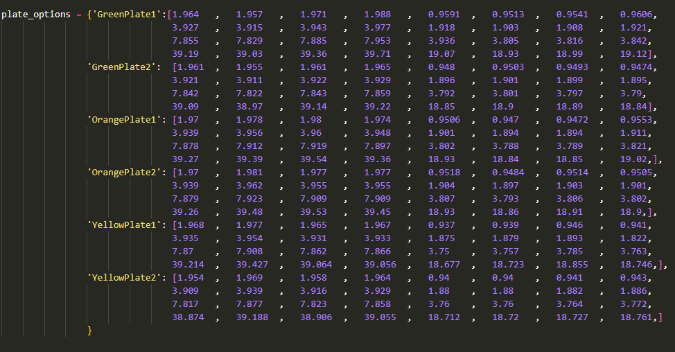

# AutoPlateCal 🔢
AutoPlateCal is a command line interface that allows users to automatically input force plate sensitivities/calibration data into Measurement, Analysis and Reporting Software ([MARS](http://mars.s2p.si/en/)) and Kistler [BioWare](https://www.kistler.com/INT/en/cp/data-acquisition-software-bioware-for-force-plates-2812a/P0000203).

In order to use please change the the calibration values in either the `AutoPlateCal.py` or `AutoPlateCal-time-delay.py` with your force plate values. You can then use the `auto-exe-builder.py` to build an executable using [PyInstaller](https://pyinstaller.org/en/stable/).

__Example of values to change for force sensitivities.__

`AutoPlateCal.py`: Will only input when a user double clicks in the start location. Will terminate after a single mouse press after inputting has started.

`AutoPlateCal-time-delay.py`: Will start inputting after the users desired timed delay.

# requirements.txt
- altgraph==0.17.4
- ansicon==1.89.0
- blessed==1.20.0
- cachetools==5.5.0
- editor==1.6.6
- inquirer==3.4.0
- jinxed==1.3.0
- MouseInfo==0.1.3
- packaging==24.1
- pefile==2024.8.26
- pillow==10.4.0
- py2exe==0.13.0.2
- PyAutoGUI==0.9.54
- PyGetWindow==0.0.9
- pyinstaller==5.13.2
- pyinstaller-hooks-contrib==2024.8
- PyMsgBox==1.0.9
- pynput==1.7.7
- pyperclip==1.9.0
- PyRect==0.2.0
- PyScreeze==1.0.1
- pytweening==1.2.0
- pywin32-ctypes==0.2.3
- readchar==4.2.0
- runs==1.2.2
- six==1.16.0
- wcwidth==0.2.13
- xmod==1.8.1